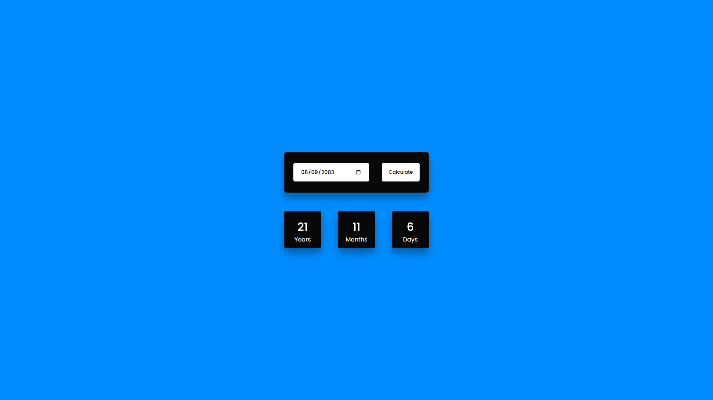
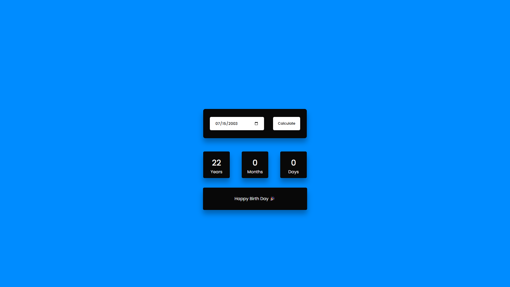

# 🧮 Age Calculator

A simple and user-friendly age calculator web app built with HTML, CSS, and JavaScript.  
It calculates your exact age based on your birthdate input.

---

## 🚀 Live Demo

🌐 [View Live Demo](https://abd-el-rahman-adel-dev.github.io/CodeAlpha_Tasks_AgeCalculator/)

---

## 📢 Featured on LinkedIn

🔗 [Check out the LinkedIn post](https://www.linkedin.com/posts/abd-el-rahman-adel-dev_javascript-html-css-activity-7244852249334566912-8EBz?utm_source=share&utm_medium=member_desktop&rcm=ACoAAEah8IkBjMk2EJi1EE6Ixmd0ZbtCvA9HqIg)

---

## 📸 Screenshot

 <!-- أضف صورة واجهة التطبيق إذا متوفرة -->
 <!-- أضف صورة واجهة التطبيق إذا متوفرة -->

---

## ✨ Features

- Calculate age in years, months, and days  
- User input validation  
- Responsive design for all screen sizes  
- Clean and simple UI

---

## 🛠 Tech Stack

- HTML5  
- CSS3  
- JavaScript (Vanilla)

---

## 📦 Getting Started

To run the project locally:

```bash
git clone https://github.com/abd-el-rahman-adel-dev/CodeAlpha_Tasks_AgeCalculator.git
cd CodeAlpha_Tasks_AgeCalculator
open index.html
```

Or just double-click `index.html` in your file manager.

---

## 📁 Project Structure

```
📦 CodeAlpha_Tasks_AgeCalculator
┣ 📂 css
┣ 📂 images
┣ 📜 index.html
┣ 📜 script.js

```

---

## 📄 License

This project is licensed under the [MIT License](./LICENSE).

---

## 🙋‍♂️ Author

- [Abd El-Rahman Adel](https://github.com/abd-el-rahman-adel-dev)
- [LinkedIn](https://www.linkedin.com/in/abdelrahman-adel-webdev)

---

> ⭐ If you like this project, please consider starring the repository!
